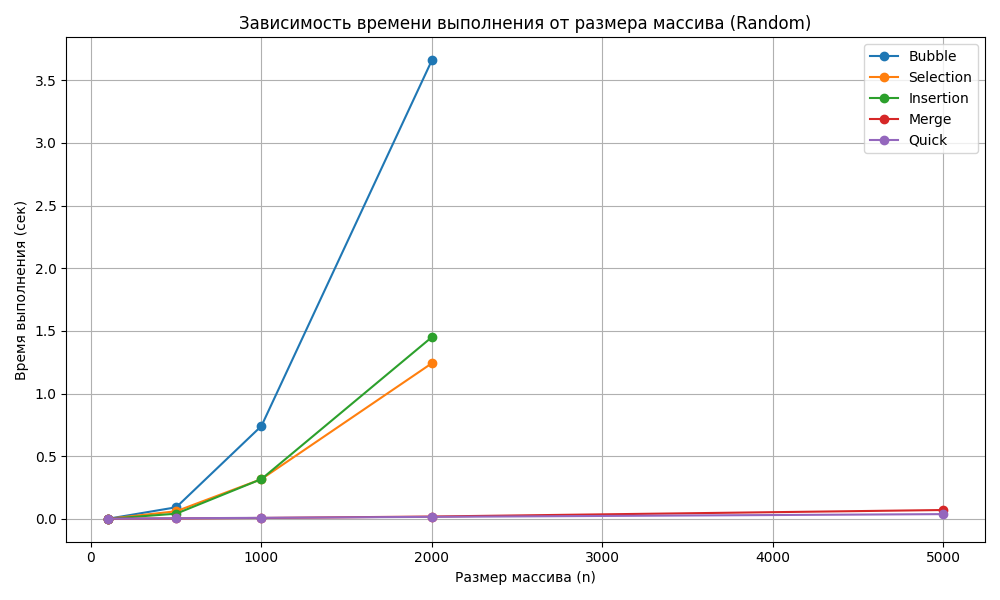

# Результаты лабораторной работы №4 — Сортировки

## 1. Графики зависимости времени и памяти от размера массива (Random)

## 2. Графики зависимости времени и памяти от типа данных (n=5000)

## 3. Сводная таблица результатов

| Algorithm   |   ('Memory (KB)', 'Almost_Sorted') |   ('Memory (KB)', 'Random') |   ('Memory (KB)', 'Reversed') |   ('Memory (KB)', 'Sorted') |   ('Time', 'Almost_Sorted') |   ('Time', 'Random') |   ('Time', 'Reversed') |   ('Time', 'Sorted') |
|:------------|-----------------------------------:|----------------------------:|------------------------------:|----------------------------:|----------------------------:|---------------------:|-----------------------:|---------------------:|
| Bubble      |                             7.2575 |                      7.2575 |                        7.2575 |                       7.22  |                   0.67553   |            1.12322   |              1.41999   |            0.001024  |
| Insertion   |                             7.165  |                      7.165  |                        7.165  |                       7.165 |                   0.0568085 |            0.452075  |              0.738383  |            0.001582  |
| Merge       |                            28.766  |                     28.522  |                       33.642  |                      33.642 |                   0.0188632 |            0.0198016 |              0.0129132 |            0.0129692 |
| Quick       |                            48.8    |                     61.016  |                       42.886  |                      42.836 |                   0.0112022 |            0.0131914 |              0.01054   |            0.0102878 |
| Selection   |                             7.255  |                      7.255  |                        7.255  |                       7.255 |                   0.397493  |            0.404807  |              0.418386  |            0.408659  |