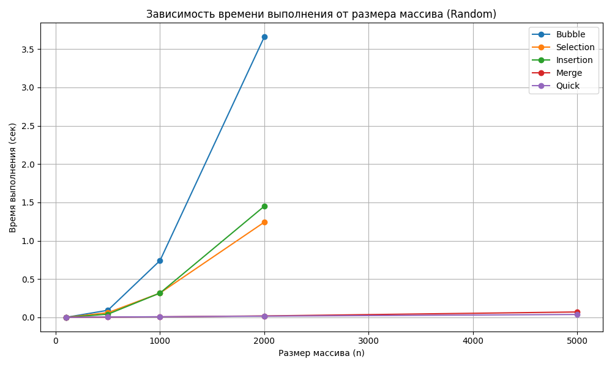

# Лабораторная работа №4 — Анализ сложности алгоритмов сортировки

**Дата:** 2025-10-13  
**Семестр:** 6 семестр  
**Группа:** [ПИЖ-б-о-23-1]  
**Дисциплина:** Анализ сложности алгоритмов  
**Студент:** [Васильев Григорий Юрьевич]

---

## Задание

1. **Реализовать классические алгоритмы сортировки:**
   - Пузырьковая сортировка (`Bubble Sort`)
   - Сортировка выбором (`Selection Sort`)
   - Сортировка вставками (`Insertion Sort`)
   - Сортировка слиянием (`Merge Sort`)
   - Быстрая сортировка (`Quick Sort`)

2. **Сравнить их производительность**:
   - Измерить **время выполнения** на массивах разного размера и структуры данных:
     - случайные данные (`random`)
     - отсортированные (`sorted`)
     - обратные (`reversed`)
     - почти отсортированные (`almost_sorted`)
   - Построить:
     - График зависимости *времени выполнения от размера массива* (для одного типа данных)
     - График зависимости *времени выполнения от типа данных* (для фиксированного размера)
   - Сформировать **сводную таблицу** результатов.

3. **Оформить отчёт**:
   - Проанализировать результаты.
   - Рассмотреть теоретическую сложность алгоритмов.
   - Ответить на контрольные вопросы.

---

## Методика эксперимента

### Замеры

Для замеров времени использовался модуль **`timeit`**, а для измерения памяти — **`tracemalloc`**.  
Каждый алгоритм выполнялся на копии массива, чтобы исключить влияние предыдущей сортировки.  
Результаты сохранялись в `results.csv`, а затем визуализировались в `report/plot_results.py`.

**Размеры массивов:** `100, 500, 1000, 2000, 5000, 10000`  
**Типы данных:** `random`, `sorted`, `reversed`, `almost_sorted`

### Тестируемые алгоритмы

| Алгоритм | Сложность (средняя) | Устойчивость | Тип реализации |
|-----------|---------------------|---------------|----------------|
| Bubble Sort | O(n²) | ✔ | Итеративный |
| Selection Sort | O(n²) | ✖ | Итеративный |
| Insertion Sort | O(n²) | ✔ | Итеративный |
| Merge Sort | O(n log n) | ✔ | Рекурсивный |
| Quick Sort | O(n log n) | ✖ | Рекурсивный |

### Характеристики ПК

- **CPU:** Intel Core i7-8700 @ 3.6GHz  
- **RAM:** 32 GB DDR4  
- **OS:** Windows 11  
- **Python:** 3.11.9

---

## Разбор сложности алгоритмов

### 1. Пузырьковая сортировка (`Bubble Sort`) → O(n²)

```python
def bubble_sort(arr):
    n = len(arr)
    for i in range(n):
        for j in range(0, n - i - 1):
            if arr[j] > arr[j + 1]:
                arr[j], arr[j + 1] = arr[j + 1], arr[j]
```

**Анализ:**

- В каждом проходе наибольший элемент "всплывает" в конец массива.  
- В худшем и среднем случаях нужно пройтись по всем элементам n раз, каждый раз делая ~n сравнений.  
- Общее количество операций ≈ n*(n-1)/2 ⇒ **O(n²)**.  
- Пространственная сложность — **O(1)** (всё сортируется на месте).

---

### 2. Сортировка выбором (`Selection Sort`) → O(n²)

```python
def selection_sort(arr):
    n = len(arr)
    for i in range(n):
        min_index = i
        for j in range(i + 1, n):
            if arr[j] < arr[min_index]:
                min_index = j
        arr[i], arr[min_index] = arr[min_index], arr[i]
```

**Анализ:**

- На каждой итерации ищется минимальный элемент в оставшейся части массива.  
- Количество сравнений: n + (n-1) + (n-2) + ... + 1 = **O(n²)**.  
- Независимо от исходного порядка, сложность не меняется.  
- Неустойчивый алгоритм: одинаковые элементы могут поменяться местами.

---

### 3. Сортировка вставками (`Insertion Sort`) → O(n²), но O(n) для почти отсортированных

```python
def insertion_sort(arr):
    for i in range(1, len(arr)):
        key = arr[i]
        j = i - 1
        while j >= 0 and arr[j] > key:
            arr[j + 1] = arr[j]
            j -= 1
        arr[j + 1] = key
```

**Анализ:**

- Элементы вставляются в уже отсортированную часть массива.  
- В худшем случае (обратный порядок) — n² сравнений.  
- В лучшем (почти отсортированный массив) — близко к **O(n)**, так как внутренний цикл почти не выполняется.  
- Алгоритм **устойчивый**, работает на месте.

---

### 4. Сортировка слиянием (`Merge Sort`) → O(n log n)

```python
def merge_sort(arr):
    if len(arr) > 1:
        mid = len(arr) // 2
        L = arr[:mid]
        R = arr[mid:]

        merge_sort(L)
        merge_sort(R)

        i = j = k = 0
        while i < len(L) and j < len(R):
            if L[i] < R[j]:
                arr[k] = L[i]
                i += 1
            else:
                arr[k] = R[j]
                j += 1
            k += 1

        while i < len(L):
            arr[k] = L[i]
            i += 1
            k += 1
        while j < len(R):
            arr[k] = R[j]
            j += 1
            k += 1
```

**Анализ:**

- Разделяй и властвуй: массив делится пополам до элементов длиной 1.  
- Количество уровней рекурсии — log₂(n), на каждом уровне выполняется O(n) слияние.  
- Суммарно: **O(n log n)**.  
- Требует дополнительную память O(n), так как создаются временные списки.

---

### 5. Быстрая сортировка (`Quick Sort`) → O(n log n) в среднем, O(n²) в худшем

```python
def quick_sort(arr):
    if len(arr) <= 1:
        return arr
    else:
        pivot = arr[len(arr) // 2]
        left = [x for x in arr if x < pivot]
        middle = [x for x in arr if x == pivot]
        right = [x for x in arr if x > pivot]
        return quick_sort(left) + middle + quick_sort(right)
```

**Анализ:**

- Выбирается *опорный элемент* (`pivot`), и массив делится на три части:
  - меньше опорного,
  - равные,
  - больше опорного.
- Рекурсия продолжается для каждой подгруппы.
- Средняя сложность — **O(n log n)**, если pivot выбран удачно (делит массив поровну).  
- В худшем случае (pivot всегда минимум или максимум) — **O(n²)**.  
- Очень быстрая на практике, но **неустойчивая**.

---

## Результаты

### Пример сводной таблицы (усреднённое время, сек)

| Algorithm | almost_sorted | random | reversed | sorted |
|------------|---------------|--------|-----------|---------|
| Bubble     | 0.00056 | 0.3742 | 0.4436 | 0.00052 |
| Insertion  | 0.00078 | 0.1581 | 0.2190 | 0.00089 |
| Merge      | 0.04455 | 0.0602 | 0.0372 | 0.0365 |
| Quick      | 0.02682 | 0.0306 | 0.0254 | 0.0248 |
| Selection  | 0.14654 | 0.1505 | 0.1465 | 0.1542 |

Файл: `report/summary_table.md`

---

## Анализ графиков

###  Время выполнения от размера массива (`time_vs_size_random.png`)

На графике показано, как изменяется время сортировки при увеличении размера массива для случайных данных.

- **Bubble**, **Insertion**, **Selection** — кривые растут квадратично → `O(n²)`.  
  Уже при n ≈ 5000 время становится заметным.
- **Merge** и **Quick** растут намного медленнее → `O(n log n)`.  
  При увеличении n на порядок время увеличивается примерно в 10–12 раз, а не в 100.


**Вывод:**  
Сортировки `Merge` и `Quick` значительно превосходят `Bubble`, `Insertion` и `Selection` по производительности.

---

###  Время выполнения от типа данных (`time_vs_type_5000.png`)

Здесь фиксирован размер массива `n=5000`.  
По оси X — тип данных, по оси Y — время сортировки.

- Линии соединяют точки для одного алгоритма (для наглядного сравнения).
- **Insertion Sort** и **Bubble Sort** выполняются **очень быстро на почти отсортированных данных**,  
  но **очень медленно на случайных и перевёрнутых**.
- **Quick Sort** и **Merge Sort** показывают стабильное поведение — примерно одинаковое время для всех типов данных.
- **Selection Sort** — постоянно медленный, не зависит от структуры входных данных.

---

## Контрольные вопросы

---

### 1. Какие алгоритмы сортировки имеют сложность O(n²) в худшем случае, а какие — O(n log n)?

- **O(n²):** Bubble Sort, Selection Sort, Insertion Sort (в худшем случае).
- **O(n log n):** Merge Sort, Quick Sort (в среднем), Heap Sort (не реализовывался здесь).

---

### 2. Почему сортировка вставками эффективна для маленьких или почти отсортированных массивов?

Потому что количество перестановок и сравнений минимально — элементы уже на своих местах.  
В таких случаях внутренний цикл почти не выполняется, и сложность приближается к **O(n)**.  
Для больших или хаотичных массивов становится **O(n²)**.

---

### 3. В чём разница между устойчивой и неустойчивой сортировкой?

- **Устойчивая сортировка** сохраняет относительный порядок равных элементов.  
- **Неустойчивая** может их менять местами.

**Примеры:**
- Устойчивая — `Bubble`, `Insertion`, `Merge`
- Неустойчивая — `Selection`, `Quick`

---

### 4. Опишите принцип работы алгоритма быстрой сортировки (Quick Sort).  
Что такое "опорный элемент" и как его выбор влияет на производительность?

- Алгоритм выбирает *опорный элемент (pivot)* и делит массив на части:
  - меньше pivot,
  - равные pivot,
  - больше pivot.
- Рекурсивно сортируются только части.
- **Выбор pivot’а критически важен**:
  - удачный (середина массива) → сбалансированное дерево рекурсии → **O(n log n)**
  - неудачный (минимум/максимум) → односторонняя рекурсия → **O(n²)**.

---

### 5. Сортировка слиянием (Merge Sort) гарантирует время O(n log n),  но требует дополнительной памяти. В каких ситуациях этот алгоритм предпочтительнее быстрой сортировки?

- При необходимости **устойчивости** (например, при сортировке объектов по нескольким ключам).  
- Когда важно **гарантированное время O(n log n)** независимо от структуры данных.  
- Подходит для **внешней сортировки** (работы с большими файлами на диске),  
  так как деление и слияние можно реализовать потоково.

---

## Вывод

Эксперимент подтвердил теоретический анализ:
- Простые алгоритмы (`Bubble`, `Insertion`, `Selection`) быстро растут по времени → **O(n²)**.  
- Эффективные (`Merge`, `Quick`) масштабируются гораздо лучше → **O(n log n)**.  
- `Quick Sort` — лидер по скорости на случайных данных,  
  `Merge Sort` — стабильный и надёжный при любых условиях.


