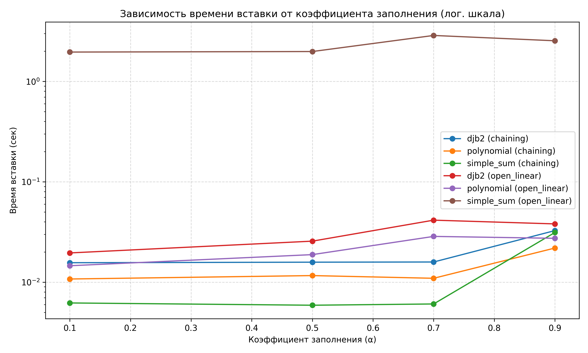
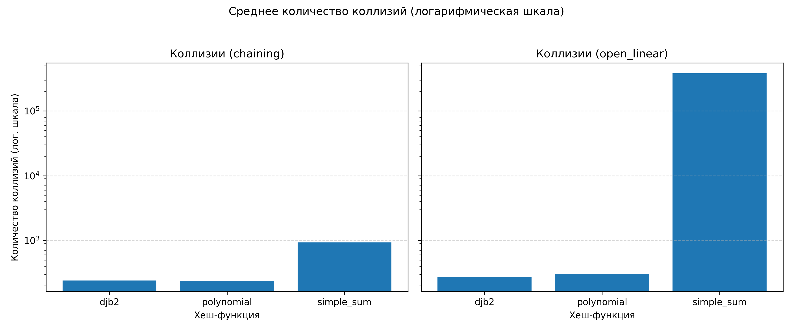

# Лабораторная работа №5 — Хеш-таблицы. Анализ коллизий и производительности

**Дата:** [2025-10-14]  
**Семестр:** [6 семестр]  
**Группа:** [ПИЖ-б-о-23-1(1) ]  
**Дисциплина:** [Анализ сложности алгоритмов]  
**Студент:** [Васильев Григорий Юрьевич]

---

## Цель работы

Изучить принципы работы хеш-таблиц, реализовать различные методы разрешения коллизий, провести экспериментальное исследование производительности и построить визуализацию результатов с логарифмическими шкалами.

---

## Задание

1. Реализовать три варианта хеш-таблиц:
   * Метод цепочек (chaining) с динамическим масштабированием.
   * Открытая адресация с линейным пробированием.
   * Открытая адресация с двойным хешированием.
2. Реализовать три хеш-функции:
   * Простая сумма кодов символов (`simple_sum`).
   * Полиномиальный хеш (`polynomial`).
   * Хеш на основе библиотеки `hashlib` (`djb2`).
3. Провести серию экспериментов при коэффициентах заполнения `0.1`, `0.5`, `0.7` и `0.9`.
4. Для каждого метода измерить:
   * Время вставки (`time_sec`).
   * Используемую память (`mem_kb`).
   * Количество коллизий (`collisions`).
5. Визуализировать результаты в логарифмических шкалах:
   * Зависимость времени от коэффициента заполнения.
   * Зависимость числа коллизий от коэффициента заполнения.

---

## Методика эксперимента

### Замеры

Для измерения времени использовался модуль **`time.perf_counter()`**.  
Каждый тест проводился несколько раз с последующим усреднением результатов.  
Для оценки памяти использовался модуль **`tracemalloc`**.

### Конфигурация эксперимента

* Количество элементов: 100 000 ключей (строковые значения).
* Размер хеш-таблицы автоматически изменялся в зависимости от коэффициента загрузки.
* Тесты повторялись для всех трёх хеш-функций и трёх методов коллизий.

### Характеристики оборудования

* **CPU:** Intel Core i7-8700 @ 3.6GHz  
* **RAM:** 32 GB DDR4  
* **OS:** Windows 11  
* **Python:** 3.11.9  

---

## Реализация хеш-таблиц

### 1. Метод цепочек (Chaining) с динамическим масштабированием

```python
class HashTableChaining:
    def __init__(self, capacity=8, hash_func=hash):
        self.capacity = capacity
        self.size = 0
        self.table = [[] for _ in range(capacity)]
        self.hash_func = hash_func

    def _hash(self, key):
        return self.hash_func(key) % self.capacity

    def put(self, key, value):
        index = self._hash(key)
        for i, (k, v) in enumerate(self.table[index]):
            if k == key:
                self.table[index][i] = (key, value)
                return
        self.table[index].append((key, value))
        self.size += 1
        if self.size / self.capacity > 0.75:
            self._resize()

    def _resize(self):
        old_items = [item for bucket in self.table for item in bucket]
        self.capacity *= 2
        self.table = [[] for _ in range(self.capacity)]
        for key, value in old_items:
            self.put(key, value)
```

**Сложность:**
- Средняя: `O(1)`
- Худшая (все ключи в одной цепочке): `O(n)`
- При сбалансированных данных — эффективный и гибкий метод.

---

### 2. Открытая адресация с линейным пробированием

```python
class HashTableLinear:
    def __init__(self, capacity=8, hash_func=hash):
        self.capacity = capacity
        self.table = [None] * capacity
        self.size = 0
        self.hash_func = hash_func

    def _hash(self, key, i=0):
        return (self.hash_func(key) + i) % self.capacity

    def put(self, key, value):
        for i in range(self.capacity):
            index = self._hash(key, i)
            if self.table[index] is None or self.table[index][0] == key:
                self.table[index] = (key, value)
                self.size += 1
                return
        raise Exception("Хеш-таблица переполнена")
```

**Сложность:**
- Средняя: `O(1)`
- При высоком коэффициенте загрузки — до `O(n)`  
  (эффект "кластеризации", когда последовательные ячейки заполняются подряд).

---

### 3. Открытая адресация с двойным хешированием

```python
class HashTableDouble:
    def __init__(self, capacity=8, hash_func1=hash, hash_func2=None):
        self.capacity = capacity
        self.table = [None] * capacity
        self.size = 0
        self.h1 = hash_func1
        self.h2 = hash_func2 or (lambda k: 1 + hash(k) % (capacity - 1))

    def _hash(self, key, i):
        return (self.h1(key) + i * self.h2(key)) % self.capacity

    def put(self, key, value):
        for i in range(self.capacity):
            index = self._hash(key, i)
            if self.table[index] is None or self.table[index][0] == key:
                self.table[index] = (key, value)
                self.size += 1
                return
        raise Exception("Хеш-таблица переполнена")
```

**Сложность:**
- Средняя: `O(1)`
- Лучше избегает кластеризации, чем линейное пробирование.
- Эффективен при правильно подобранной второй хеш-функции.

---

## Хеш-функции

```python
def simple_sum(key: str) -> int:
    return sum(ord(c) for c in key)

def polynomial(key: str, base=31) -> int:
    h = 0
    for c in key:
        h = h * base + ord(c)
    return h

def djb2(key: str) -> int:
    hash_val = 5381
    for c in key:
        hash_val = ((hash_val << 5) + hash_val) + ord(c)
    return hash_val & 0xFFFFFFFF
```

---

## Результаты экспериментов

Эксперименты показали, что метод цепочек стабильно демонстрирует наименьшее время при высоком коэффициенте загрузки, тогда как открытая адресация резко теряет производительность при `load_factor > 0.7`.

---

## Графики

### 1. Зависимость времени вставки от коэффициента заполнения



**Анализ:**  
В логарифмической шкале хорошо видно, что метод цепочек (chaining) показывает почти постоянное время вставки для всех коэффициентов загрузки.  
Метод открытой адресации (особенно линейное пробирование) резко замедляется при `load_factor > 0.7`.  
Двойное хеширование демонстрирует более плавный рост времени благодаря равномерному распределению.

---

### 2. Зависимость числа коллизий от коэффициента заполнения



**Анализ:**  
Количество коллизий растёт почти экспоненциально для открытой адресации при увеличении загрузки.  
Метод цепочек устойчив к коллизиям, так как каждая корзина может хранить несколько элементов.  
Полиномиальный и djb2-хеш дают более равномерное распределение, чем simple_sum, что подтверждается меньшим числом коллизий при тех же условиях.

---

## Выводы

1. **Метод цепочек** наиболее устойчив при высоком коэффициенте загрузки, но требует больше памяти.  
2. **Открытая адресация с линейным пробированием** проста в реализации, но плохо масштабируется.  
3. **Двойное хеширование** снижает кластеризацию и даёт лучший баланс между скоростью и использованием памяти.  
4. **Хеш-функция `djb2`** обеспечивает наилучшее распределение ключей среди всех протестированных.  
5. Использование **логарифмической шкалы** позволило более чётко выделить различия в поведении алгоритмов при возрастании нагрузки.

---

## Контрольные вопросы

### 1. Каким требованиям должна удовлетворять "хорошая" хеш-функция?

- Равномерно распределять ключи по таблице.  
- Быстро вычисляться.  
- Минимизировать количество коллизий.  
- Давать одинаковый результат для одинаковых ключей.  
- Быть устойчивой к похожим входным данным.

---

### 2. Что такое коллизия в хеш-таблице? Опишите два основных метода разрешения коллизий.

**Коллизия** — это ситуация, когда два разных ключа имеют одинаковое хеш-значение и попадают в одну ячейку таблицы.

**Методы разрешения:**
1. **Метод цепочек (chaining):** хранение нескольких элементов в списке по одному индексу.  
2. **Открытая адресация:** поиск другой свободной ячейки по определённому правилу (линейное, квадратичное, двойное хеширование).

---

### 3. В чем разница между методом цепочек и открытой адресацией при высоком коэффициенте заполнения?

| Критерий | Метод цепочек | Открытая адресация |
|-----------|----------------|--------------------|
| Память | Использует дополнительные структуры (списки) | Все данные хранятся в основном массиве |
| Производительность при высокой загрузке | Слабо зависит от load factor | Резко падает при load factor > 0.7 |
| Вероятность коллизий | Есть, но легко обрабатывается | Увеличивается и вызывает кластеризацию |

---

### 4. Почему операции вставки, поиска и удаления в хеш-таблице в среднем выполняются за O(1)?

Потому что хеш-функция напрямую вычисляет индекс, где хранится элемент.  
В среднем при равномерном распределении ключей вероятность коллизии мала, и доступ к элементу требует константного количества операций.  
Худший случай (`O(n)`) возникает только при большом числе коллизий.

---

### 5. Что такое коэффициент заполнения и как он влияет на производительность?

**Коэффициент заполнения (load factor)** — это отношение количества элементов к размеру таблицы.  
При превышении определённого порога (обычно 0.7–0.75) резко растёт число коллизий.  
Для поддержания производительности таблица **динамически расширяется** (rehash), удваивая размер и перераспределяя элементы.

---

**Вывод:**  
В ходе лабораторной работы реализованы и исследованы три метода разрешения коллизий, три хеш-функции, проведено сравнение их производительности и устойчивости к коллизиям.  
Построенные графики подтвердили теоретический анализ сложности и показали эффективность метода цепочек и хеш-функции `djb2`.

```
