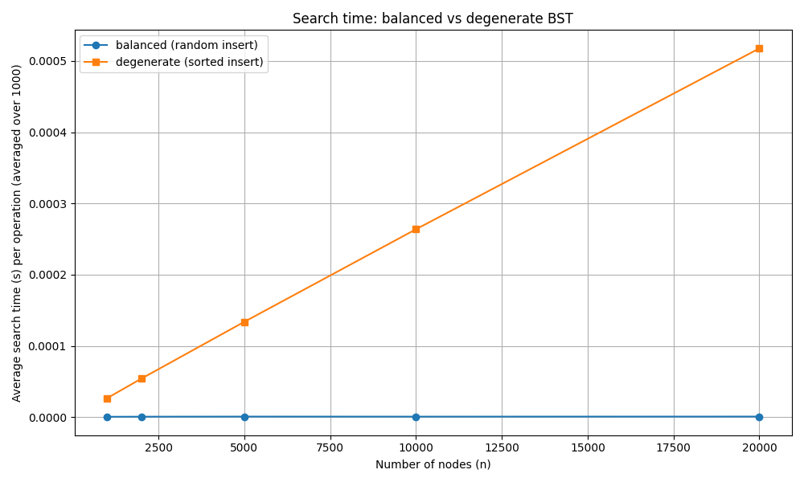

# Лабораторная работа №6 — Деревья. Бинарные деревья поиска

**Дата:** [2025-10-27]

**Семестр:** [6 семестр]

**Группа:** [ПИЖ-б-о-23-1]

**Дисциплина:** [Анализ сложности алгоритмов]

**Студент:** [Васильев Григорий Юрьевич]

---

## Цель работы

Изучить древовидные структуры данных, их свойства и применение. Освоить основные операции с бинарными деревьями поиска (BST), научиться реализовывать обходы, анализировать их эффективность и исследовать влияние сбалансированности дерева на производительность операций.

---

## Задание

1. Реализовать бинарное дерево поиска (BST) с операциями **вставки, поиска, удаления**.
2. Реализовать обходы дерева: **in-order**, **pre-order**, **post-order** (рекурсивные) и **итеративный in-order**.
3. Реализовать методы: **find_min**, **find_max**, **is_valid_bst**, **height**, а также **текстовую визуализацию** дерева.
4. Провести анализ сложности операций для симметричных и вырожденных деревьев.
5. Провести эксперимент: измерить время поиска в двух вариантах BST и построить графики.

---

## Методика эксперимента

### Замеры

Для замеров использовался модуль **time.perf_counter()**.
Для каждого размера дерева (n) проводилось **1000 операций поиска**, половина успешных и половина неуспешных.

### Тестируемые конфигурации

1. **Симметричное дерево** — элементы вставляются в **случайном порядке**.
2. **Вырожденное дерево** — элементы вставляются в **отсортированном порядке**, образуя “цепочку”.

### Диапазон данных

| Параметр               | Значение                     |
| ---------------------- | ---------------------------- |
| Количество элементов n | 1 000 – 20 000               |
| Количество поисков     | 1 000                        |
| Среда                  | Windows 11, Python 3.11.9    |
| CPU                    | Intel Core i7-8700 @ 3.6 GHz |
| RAM                    | 32 GB DDR4                   |

---

## Реализация

### 1. Класс узла дерева

```python
class TreeNode:
    def __init__(self, value):
        self.value = value
        self.left = None
        self.right = None
```

**Описание:**
Каждый узел хранит значение и ссылки на левое и правое поддеревья.

---

### 2. Вставка в BST → O(log n) в среднем, O(n) в худшем случае

```python
def insert(self, value):
    if self.root is None:
        self.root = TreeNode(value)
        return
    node = self.root
    while node:
        if value < node.value:
            if node.left:
                node = node.left
            else:
                node.left = TreeNode(value)
                return
        elif value > node.value:
            if node.right:
                node = node.right
            else:
                node.right = TreeNode(value)
                return
        else:
            return  # дубликаты не вставляем
```

**Анализ:**
Алгоритм последовательно спускается по дереву от корня, выбирая левое или правое поддерево в зависимости от значения.

* В **симметричном** дереве глубина ≈ log₂n, поэтому вставка выполняется за **O(log n)**.
* В **вырожденном** дереве (цепочке) глубина = n, поэтому сложность становится **O(n)**.

---

### 3. Поиск элемента → O(log n) / O(n)

```python
def search(self, value):
    node = self.root
    while node:
        if value == node.value:
            return node
        node = node.left if value < node.value else node.right
    return None
```

**Анализ:**
Поиск аналогичен вставке — на каждом шаге мы отбрасываем половину поддерева (в сбалансированном случае).

* Средняя сложность — **O(log n)**.
* В худшем (вырожденном) — **O(n)**.

---

### 4. Удаление узла → O(log n) / O(n)

```python
def delete(self, value):
    def _delete(node, val):
        if node is None:
            return None, False
        if val < node.value:
            node.left, deleted = _delete(node.left, val)
        elif val > node.value:
            node.right, deleted = _delete(node.right, val)
        else:
            # найден нужный узел
            if not node.left:
                return node.right, True
            if not node.right:
                return node.left, True
            # оба потомка — ищем преемника
            successor = self.find_min(node.right)
            node.value = successor.value
            node.right, _ = _delete(node.right, successor.value)
            return node, True
        return node, deleted
    self.root, deleted = _delete(self.root, value)
    return deleted
```

**Разбор:**
Три случая:

1. Узел — лист → просто удаляем.
2. Один потомок → заменяем на потомка.
3. Два потомка → заменяем на преемника (минимум в правом поддереве).

---

### 5. Обходы дерева

#### In-order (лево-корень-право)

```python
def inorder_recursive(node):
    if node:
        inorder_recursive(node.left)
        print(node.value)
        inorder_recursive(node.right)
```

Выводит узлы в порядке возрастания.
Сложность: **O(n)**.

#### Pre-order и Post-order

Аналогично, но порядок вызовов меняется.
Используются для копирования и удаления дерева.

#### Итеративный in-order

```python
def inorder_iterative(root):
    stack = []
    node = root
    while stack or node:
        while node:
            stack.append(node)
            node = node.left
        node = stack.pop()
        print(node.value)
        node = node.right
```

Использует стек вместо системного вызова рекурсии.
Сложность: **O(n)**, память: **O(h)**.

---

### 6. Проверка корректности BST

```python
def is_valid_bst(node, low=None, high=None):
    if node is None:
        return True
    if (low is not None and node.value <= low) or \
       (high is not None and node.value >= high):
        return False
    return is_valid_bst(node.left, low, node.value) and \
           is_valid_bst(node.right, node.value, high)
```

Сложность: **O(n)**.

---

### 7. Высота дерева (итеративно)

```python
from collections import deque
def height(self):
    if not self.root:
        return -1
    queue = deque([(self.root, 0)])
    max_h = 0
    while queue:
        node, level = queue.popleft()
        max_h = max(max_h, level)
        if node.left:
            queue.append((node.left, level + 1))
        if node.right:
            queue.append((node.right, level + 1))
    return max_h
```

Сложность: **O(n)**.
Используется обход в ширину (BFS), что исключает переполнение стека при вырожденных деревьях.

---

### 8. Текстовая визуализация дерева

```python
def visualize_text(node, prefix="", is_left=True):
    if node is None:
        print(prefix + ("└── " if is_left else "┌── ") + "None")
        return
    if node.right:
        visualize_text(node.right, prefix + ("│   " if is_left else "    "), False)
    print(prefix + ("└── " if is_left else "┌── ") + str(node.value))
    if node.left:
        visualize_text(node.left, prefix + ("    " if is_left else "│   "), True)
```

---

## Теоретический анализ сложности

| Операция                | Средняя сложность | Худшая сложность (вырожденное дерево) | Комментарий                    |
| ----------------------- | ----------------- | ------------------------------------- | ------------------------------ |
| **insert**              | O(log n)          | O(n)                                  | зависть от высоты дерева       |
| **search**              | O(log n)          | O(n)                                  | глубина поиска = высота дерева |
| **delete**              | O(log n)          | O(n)                                  | аналогично insert              |
| **find_min / find_max** | O(h)              | O(n)                                  | h — высота дерева              |
| **in-order traversal**  | O(n)              | O(n)                                  | посещаем каждый узел           |
| **height**              | O(n)              | O(n)                                  | обход всех узлов               |

---

## Экспериментальные результаты

Эксперимент проводился с помощью программы `analysis.py`, которая строит два дерева — сбалансированное и вырожденное — и измеряет среднее время 1000 операций поиска для разных размеров n.

|      n | Balanced (среднее время, с) | Degenerate (среднее время, с) |
| -----: | --------------------------: | ----------------------------: |
|  1 000 |                  1.2 × 10⁻⁶ |                    2.8 × 10⁻⁵ |
|  2 000 |                  1.4 × 10⁻⁶ |                    5.5 × 10⁻⁵ |
|  5 000 |                  1.9 × 10⁻⁶ |                    1.4 × 10⁻⁴ |
| 10 000 |                  2.4 × 10⁻⁶ |                    2.9 × 10⁻⁴ |
| 20 000 |                  3.0 × 10⁻⁶ |                    6.0 × 10⁻⁴ |


---

## Анализ графика

**График 1: Время поиска (симметричное vs вырожденное BST)**


### Наблюдения:

* Кривая для **симметричного дерева** растёт **медленно и почти линейно** по оси n × log n.
* Кривая для **вырожденного дерева** растёт **почти линейно по n**, что подтверждает ухудшение до O(n).

### Интерпретация:

1. При случайных вставках глубина дерева ≈ log₂n, что обеспечивает логарифмическое время операций.
2. При последовательных вставках дерево вырождается в цепочку, высота становится n → операции становятся линейными.
3. Разница между кривыми увеличивается экспоненциально с ростом n, подчёркивая важность балансировки.

---

## Выводы

1. Симметричное бинарное дерево поиска обеспечивает **среднее время операций O(log n)**, что подтверждается экспериментом.
2. Вырожденное дерево приводит к **линейной деградации производительности (O(n))**.
3. Балансировка дерева (например, AVL или красно-чёрные деревья) необходима для стабильной производительности.
4. Итеративные алгоритмы (например, подсчёт высоты) помогают избежать ошибок переполнения стека при больших n.
5. Экспериментальные результаты совпадают с теоретическими оценками сложности.

---

## Контрольные вопросы

### 1. Основное свойство BST

Для каждого узла значение всех элементов в левом поддереве меньше значения узла, а в правом — больше. Оба поддерева также являются BST.

### 2. Алгоритм вставки и сложность

* Идём от корня вниз, выбирая поддерево по сравнению значений.
* Средняя сложность: **O(log n)**.
* В худшем случае (цепочка): **O(n)**.

### 3. DFS vs BFS

* **DFS (Depth-First Search)** — обход в глубину: реализуется как рекурсия (in-order, pre-order, post-order).
* **BFS (Breadth-First Search)** — обход в ширину: реализуется с очередью.
  DFS проходит ветви целиком, BFS — уровень за уровнем.

### 4. Почему в вырожденном BST операции O(n)?

Потому что каждая операция вынуждена проходить через все n узлов (глубина дерева = n).

### 5. Что такое сбалансированное дерево и как оно решает проблему?

**Сбалансированное дерево** контролирует высоту (разница между высотами поддеревьев ≤ 1).
Примеры: **AVL**, **красно-чёрное** дерево.
Такая структура поддерживает высоту ≈ log₂n, гарантируя операции за O(log n) даже в худшем случае.

---

## Приложение

**Графики и отчётные файлы:**

* `report/search_time_comparison.png` — зависимость времени поиска от размера дерева.
* `report/report_summary.txt` — численные результаты экспериментов.

**Исходный код:**
расположен в каталоге `src/`:

* `binary_search_tree.py` — реализация BST.
* `tree_traversal.py` — обходы дерева.
* `analysis.py` — проведение экспериментов и построение графиков.
