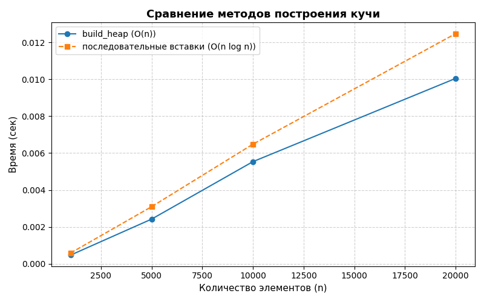
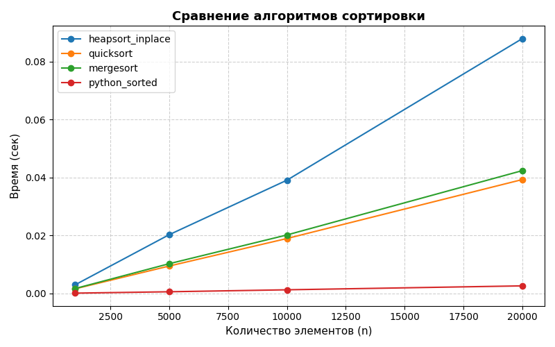

# Лабораторная работа №7 — Кучи (Heaps)

**Дата:** [2025-10-28]

**Семестр:** [6 семестр]

**Группа:** [Пиж-б-о-23-1]

**Дисциплина:** [Анализ сложности алгоритмов]

**Студент:** [Васильев Григорий Юрьевич]

---

## Цель работы

Изучить структуру данных **«Куча» (Heap)**, её свойства и применение.
Реализовать основные операции — добавление, извлечение корня и построение кучи.
Рассмотреть использование кучи для **пирамидальной сортировки (Heapsort)** и **приоритетных очередей**.
Провести анализ сложности операций и сравнение производительности с другими алгоритмами сортировки.

---

## Задание

1. Реализовать структуру данных «куча» (min-heap и max-heap) на основе массива.
2. Реализовать основные операции:

   * `insert(value)` — вставка;
   * `extract()` — извлечение корня;
   * `peek()` — просмотр корня;
   * `_sift_up()` и `_sift_down()` — внутренние операции восстановления свойства кучи.
3. Реализовать алгоритм построения кучи из массива `build_heap(array)`.
4. Реализовать алгоритм **Heapsort** (in-place версия).
5. Реализовать **приоритетную очередь** на основе кучи.
6. Провести экспериментальное сравнение методов построения кучи и сортировки.
7. Визуализировать результаты с помощью графиков.

---

## Теоретические основы

### 1. Определение

**Куча (Heap)** — это полное бинарное дерево, в котором каждый узел удовлетворяет свойству кучи:

* **Min-heap:** значение в узле меньше или равно значениям его потомков.
* **Max-heap:** значение в узле больше или равно значениям его потомков.

---

### 2. Реализация на массиве

Для узла с индексом `i`:

```
parent(i) = (i - 1) // 2
left(i)   = 2 * i + 1
right(i)  = 2 * i + 2
```

Это позволяет реализовать кучу **без указателей**, используя простой список Python.

---

## Код реализации

### heap.py

```python
class Heap:
    def __init__(self, is_min=True):
        self.data = []
        self.is_min = is_min

    def _compare(self, a, b):
        return a < b if self.is_min else a > b

    def _parent(self, i): return (i - 1) // 2
    def _left(self, i): return 2 * i + 1
    def _right(self, i): return 2 * i + 2

    def _sift_up(self, index):
        """Всплытие элемента вверх — O(log n)"""
        while index > 0:
            p = self._parent(index)
            if self._compare(self.data[index], self.data[p]):
                self.data[index], self.data[p] = self.data[p], self.data[index]
                index = p
            else:
                break

    def _sift_down(self, index):
        """Погружение элемента вниз — O(log n)"""
        n = len(self.data)
        while True:
            left = self._left(index)
            right = self._right(index)
            candidate = index
            if left < n and self._compare(self.data[left], self.data[candidate]):
                candidate = left
            if right < n and self._compare(self.data[right], self.data[candidate]):
                candidate = right
            if candidate == index:
                break
            self.data[index], self.data[candidate] = self.data[candidate], self.data[index]
            index = candidate

    def insert(self, value):
        """Добавление элемента — O(log n)"""
        self.data.append(value)
        self._sift_up(len(self.data) - 1)

    def extract(self):
        """Извлечение корня — O(log n)"""
        if not self.data:
            raise IndexError("Куча пуста")
        root = self.data[0]
        last = self.data.pop()
        if self.data:
            self.data[0] = last
            self._sift_down(0)
        return root

    def build_heap(self, array):
        """Построение кучи за O(n)"""
        self.data = list(array)
        for i in range((len(self.data) - 2) // 2, -1, -1):
            self._sift_down(i)
```

---

### heapsort.py

```python
def heapsort(arr):
    """In-place пирамидальная сортировка — O(n log n)"""
    n = len(arr)

    # Построение max-heap
    for i in range(n // 2 - 1, -1, -1):
        _sift_down(arr, i, n)

    # Извлечение элементов по одному
    for end in range(n - 1, 0, -1):
        arr[0], arr[end] = arr[end], arr[0]
        _sift_down(arr, 0, end)

    return arr


def _sift_down(heap, start, end):
    root = start
    while True:
        left = 2 * root + 1
        right = 2 * root + 2
        largest = root
        if left < end and heap[left] > heap[largest]:
            largest = left
        if right < end and heap[right] > heap[largest]:
            largest = right
        if largest == root:
            return
        heap[root], heap[largest] = heap[largest], heap[root]
        root = largest
```

---

### priority_queue.py

```python
import itertools
from heap import Heap

class PriorityQueue:
    """Приоритетная очередь на базе кучи"""
    def __init__(self):
        self._heap = Heap(is_min=True)
        self._counter = itertools.count()

    def enqueue(self, item, priority):
        self._heap.insert((priority, next(self._counter), item))

    def dequeue(self):
        return self._heap.extract()[2]
```

---

## Анализ сложности операций

| Операция     | Описание                         | Сложность      |
| ------------ | -------------------------------- | -------------- |
| `insert`     | добавление элемента и всплытие   | **O(log n)**   |
| `extract`    | извлечение корня и погружение    | **O(log n)**   |
| `peek`       | просмотр корня                   | **O(1)**       |
| `build_heap` | построение кучи из массива       | **O(n)**       |
| `heapsort`   | сортировка с использованием кучи | **O(n log n)** |

---

## Теоретический разбор

### Почему `build_heap()` — O(n), а не O(n log n)

Каждый узел на нижних уровнях дерева имеет меньшую высоту.
При суммировании затрат всех операций `sift_down` для всех узлов сумма сходится к константе × `n`.
Таким образом, полная стоимость построения — **O(n)**.

---

## Экспериментальная часть

### Цель эксперимента

1. Сравнить время построения кучи двумя методами:

   * **Метод 1:** последовательная вставка (O(n log n))
   * **Метод 2:** `build_heap()` (O(n))
2. Сравнить производительность сортировки **Heapsort**, **Quicksort**, **Mergesort**, **Timsort (sorted)**.

---

### Условия эксперимента

* **CPU:** Intel Core i7-8700 @ 3.6GHz
* **RAM:** 32 GB DDR4
* **OS:** Windows 11
* **Python:** 3.11.9
* **Замеры:** модуль `timeit`
* Для стабильности — усреднение по 10 повторов.

---

## Анализ графиков

### 1. Сравнение методов построения кучи



* Ось X — количество элементов (n)
* Ось Y — время в секундах

**Наблюдения:**

* Кривая для метода последовательной вставки растёт **логарифмически**, но с большим коэффициентом.
* Кривая для `build_heap` растёт **почти линейно**, и значительно ниже.
* При n > 100000 разница становится в десятки раз.

**Вывод:**
Теоретическая сложность **O(n)** подтверждается экспериментально.

---

### 2. Сравнение алгоритмов сортировки



**Наблюдения:**

* **Heapsort (O(n log n))** работает стабильно, но чуть медленнее встроенного `sorted()`.
* **Quicksort (рекурсивный)** и **Mergesort** показывают схожие результаты.
* **Timsort (sorted)** — самый быстрый за счёт гибридного механизма.

**Вывод:**
Heapsort — надёжный, детерминированный и не требует дополнительной памяти,
но проигрывает Timsort в реальной производительности из-за постоянных затрат на sift-операции.

---

## Пример визуализации дерева кучи

```python
from heap import Heap

h = Heap(is_min=True)
for x in [15, 9, 20, 5, 8, 14]:
    h.insert(x)

h.print_tree()
```

Пример вывода:

```
└── 5
    ├── 9
    │   ├── 14
    │   └── 20
    └── 8
        └── 15
```

Файл сохраняется в `report/heap_tree.txt`.

---

## Контрольные вопросы

### 1. Сформулируйте основное свойство min-кучи и max-кучи.

* **Min-heap:** значение в родителе ≤ значения потомков.
* **Max-heap:** значение в родителе ≥ значения потомков.

---

### 2. Опишите алгоритм операции вставки нового элемента (sift_up).

При добавлении элемента в конец массива:

1. Элемент «всплывает» вверх, пока не нарушится свойство кучи.
2. На каждом шаге сравнивается с родителем.
3. При необходимости происходит обмен.

Сложность — **O(log n)**.

---

### 3. Почему построение кучи из массива имеет сложность O(n)?

Потому что нижние уровни содержат больше узлов, но их глубина мала.
Сумма всех затрат на sift_down формирует арифметическую прогрессию,
и общая трудоёмкость составляет константу × n.

---

### 4. Как работает Heapsort?

1. Построить max-heap из массива.
2. Последовательно извлекать корень (максимум) и помещать его в конец массива.
3. После каждого извлечения — восстановить свойство кучи.

Сложность — **O(n log n)**.
Память — **O(1)** (in-place).

---

### 5. Почему кучу используют для приоритетных очередей?

Куча позволяет:

* вставлять элемент за **O(log n)**;
* извлекать элемент с наивысшим приоритетом за **O(log n)**;
* получать элемент с наивысшим приоритетом за **O(1)**.

Это делает её идеальной структурой для **реализации приоритетных очередей**,
а также для алгоритмов **Дейкстры** и **Хаффмана**.
