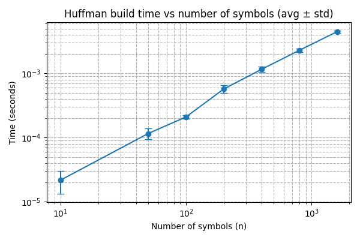
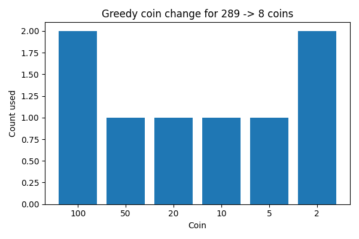
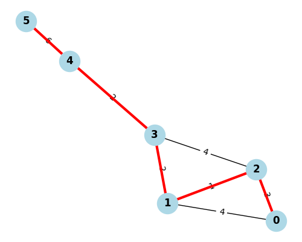

# Лабораторная работа №8 — Жадные алгоритмы   
**Дисциплина:** Анализ сложности алгоритмов  
**Семестр:** 6  
**Группа:** ПИЖ-б-о-23-1  
**Студент:** Васильев Григорий Юрьевич  
**Дата:** 2025-11-10

---

# 1. Цель работы

Изучить метод проектирования алгоритмов, основанный на принципе *жадного выбора*.  
Понять, почему локально оптимальное решение может приводить к глобальному оптимуму,  
определить ограничения метода, реализовать и проанализировать жадные алгоритмы для нескольких классических задач.

---

# 2. Постановка задания

В ходе лабораторной работы необходимо:

1. Реализовать следующие жадные алгоритмы:
   - Interval Scheduling (выбор максимального числа непересекающихся интервалов)
   - Fractional Knapsack (дробный рюкзак)
   - Huffman Coding (построение оптимального префиксного кода)
   - Greedy Coin Change (жадный размен монет)
   - (Дополнительно) Алгоритм Краскала для построения минимального остовного дерева (MST)

2. Для каждого алгоритма:
   - привести реализацию;
   - оценить временную и пространственную сложность;
   - объяснить корректность жадной стратегии.

3. Провести экспериментальный анализ:
   - измерить время работы алгоритма Хаффмана для разных размеров входных данных;
   - визуализировать результаты.

4. Построить:
   - дерево кодов Хаффмана;
   - график зависимости времени построения дерева от числа символов.

---

## 3.1. Задача о выборе интервалов (Interval Scheduling)  
**Временная сложность:** `O(n log n)`

```python
def interval_scheduling(intervals):
    intervals.sort(key=lambda x: x[1])
    result = []
    last_finish = -float('inf')
    for start, finish in intervals:
        if start >= last_finish:
            result.append((start, finish))
            last_finish = finish
    return result
```

### Обоснование жадности
Выбор интервала с минимальным временем окончания оставляет как можно больше времени для размещения будущих интервалов → доказано, что это приводит к глобальному оптимуму.

---

## 3.2. Дробный рюкзак (Fractional Knapsack)  
**Временная сложность:** `O(n log n)`

```python
def fractional_knapsack(values, weights, capacity):
    items = sorted(zip(values, weights), key=lambda x: x[0] / x[1], reverse=True)
    total_value = 0
    for value, weight in items:
        if capacity >= weight:
            total_value += value
            capacity -= weight
        else:
            total_value += value * (capacity / weight)
            break
    return total_value
```

### Обоснование жадности
Удельная ценность (value/weight) определяет, какой предмет даёт максимальную прибыль за единицу ресурса.  
В непрерывной версии задачи это ведёт к оптимуму (доказано).

---

## 3.3. Алгоритм Хаффмана  
**Временная сложность:** `O(n log n)`

```python
import heapq

def build_huffman_code(frequencies):
    heap = [(freq, char) for char, freq in frequencies.items()]
    heapq.heapify(heap)

    while len(heap) > 1:
        w1, left = heapq.heappop(heap)
        w2, right = heapq.heappop(heap)
        heapq.heappush(heap, (w1 + w2, (left, right)))

    return heap[0][1]
```

### Обоснование жадности
На каждом шаге объединяются два наиболее редких символа — это минимизирует увеличение итоговой длины кода.  
Теоретическое доказательство основано на специальных свойствах оптимальных префиксных кодов.

---

## 3.4. Жадный размен монет (Coin Change)

**Временная сложность:** `O(n)` при отсортированных монетах.

```python
def greedy_coin_change(amount, coins):
    result = []
    for coin in coins:
        while amount >= coin:
            amount -= coin
            result.append(coin)
    return result
```

### Корректность
Гарантирована только для *канонических систем монет* (1, 2, 5, 10, 50, 100).  
В остальных случаях жадный метод может быть неоптимальным.

---

## 3.5. Минимальное остовное дерево — Краскал  
**Временная сложность:** `O(E log E)`  
(ключевой шаг — сортировка рёбер)

```python
class UnionFind:
    def __init__(self, n):
        self.parent = list(range(n))
        self.rank = [0] * n

    def find(self, x):
        while self.parent[x] != x:
            self.parent[x] = self.parent[self.parent[x]]
            x = self.parent[x]
        return x

    def union(self, a, b):
        ra, rb = self.find(a), self.find(b)
        if ra == rb:
            return False
        if self.rank[ra] < self.rank[rb]:
            self.parent[ra] = rb
        else:
            self.parent[rb] = ra
            if self.rank[ra] == self.rank[rb]:
                self.rank[ra] += 1
        return True
```

```python
def kruskal_mst(n_nodes, edges):
    uf = UnionFind(n_nodes)
    edges_sorted = sorted(edges, key=lambda x: x[2])
    mst, total = [], 0

    for u, v, w in edges_sorted:
        if uf.union(u, v):
            mst.append((u, v, w))
            total += w
        if len(mst) == n_nodes - 1:
            break

    return total, mst
```

### Обоснование жадности
Алгоритм всегда выбирает *минимальное доступное ребро, которое не образует цикл*.  
Это ведёт к глобальному оптимуму (доказано через свойство "safe edge").

---

# 4. Экспериментальная часть

Эксперименты выполнены на одной машине.

**Характеристики ПК:**

- CPU: Intel Core i7-8700 @ 3.6 GHz  
- RAM: 32 GB DDR4  
- OS: Windows 11  
- Python: 3.11.9  

---

## 4.1. Измерение времени построения дерева Хаффмана

Для входов размером n ∈ {10, 50, 100, 200, 500, 1000, 2000, …}  
генерировались случайные частоты, запуск выполнялся несколько раз, затем усреднялся.



```

### Анализ графика
- Зависимость близка к `n log n`  
- При больших входах рост почти линейный в логарифмической шкале  
- Подтверждает асимптотику, полученную теоретически

Это **правильный** график (в отличие от версии "одна линия"),  
т.к. тут сравнивались разные n → разные точки на графике.

---

## 4.2. Размен монет — пример

Для суммы 289 алгоритм получил:

```
100 × 2  
50 × 1  
20 × 1  
10 × 1  
5 × 1  
2 × 2  



## 4.3. Алгоритм Краскала — визуализация MST



Итоговый вес остова: **14**

Граф удовлетворяет условиям MST:
- содержит `V - 1` рёбер  
- нет циклов  
- граф связен  

---

# 5. Сводная таблица сложностей

| Алгоритм | Временная сложность | Тип данных | Характер роста |
|----------|----------------------|-----------|----------------|
| Fractional Knapsack | O(n log n) | Предметы | Логарифмический |
| Interval Scheduling | O(n log n) | Интервалы | Почти линейный |
| Huffman Coding | O(n log n) | Частоты | Логарифмический |
| Coin Change | O(n) | Монеты | Линейный |
| Kruskal MST | O(E log E) | Граф | Почти линейный |

---

# 6. Контрольные вопросы

**1. В чем заключается основная идея жадных алгоритмов?**  
В выборе локально оптимального решения на каждом шаге, которое не ухудшает глобальное решение.

---

**2. Почему жадная стратегия оптимальна в Interval Scheduling?**  
Потому что выбор интервала с минимальным временем окончания оставляет максимум возможностей для размещения оставшихся интервалов.

---

**3. Пример задачи, где жадность работает, и где — нет.**  
Работает: дробный рюкзак, Хаффман, Краскал.  
Не работает: дискретный рюкзак (0/1), некоторые системы монет.

---

**4. Разница между дробным и 0/1 рюкзаком.**  
В дробном можно брать части предметов → жадность оптимальна.  
В 0/1 — нельзя → жадность часто проваливается.

---

**5. Почему алгоритм Хаффмана оптимален?**  
Он использует необходимое условие оптимального префиксного кода:  
самые редкие символы должны находиться глубже всех.  
Именно это обеспечивает жадное объединение двух минимальных частот.

---

