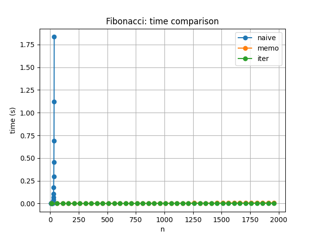

# Лабораторная работа №9 — Динамическое программирование  
**Дата:** [2025-11-25]  
**Семестр:** [6 семестр]  
**Группа:** [ПИЖ-б-0-23-1]  
**Дисциплина:** [Анализ сложности алгоритмов]  
**Студент:** [Васильев Григорий Юрьевич]

---

## Задание

1. Реализовать классические алгоритмы динамического программирования:
   * Числа Фибоначчи:  
     – наивная рекурсия  
     – рекурсия с мемоизацией  
     – итеративное DP (bottom-up)  
   * Задача о рюкзаке (0-1 knapsack)
   * Наибольшая общая подпоследовательность (LCS)
   * Редакционное расстояние (Левенштейн)
   * Задача о размене монет (min coins)

2. Выполнить сравнение производительности:
   * Fibonacci naive vs memo vs iterative

3. Реализовать восстановление решения там, где применимо.

4. Построить графики времени выполнения для различных реализаций Фибоначчи.

---

## Методика эксперимента

### Замеры

Для измерения времени выполнения использовался модуль Python **timeit**.  
Каждый тест повторялся **100 прогонов** для быстрых алгоритмов и **10 прогонов** для медленных.

### Тестируемые реализации

* `fib_naive(n)` — экспоненциальный рост  
* `fib_memo(n)` — рекурсивная мемоизация  
* `fib_iter(n)` — итеративный алгоритм (bottom-up)

Диапазоны:
* для наивного алгоритма: **n от 1 до 35**  
* для мемоизации: **n до 1000**  
* для итеративного алгоритма: **n до 20000**

### Характеристики ПК

* **CPU:** Intel Core i7-8700 @ 3.6GHz  
* **RAM:** 32 GB DDR4  
* **OS:** Windows 11  
* **Python:** 3.11.9  

---

# Разбор сложности

---

## 1. Числа Фибоначчи — наивная рекурсия (*O(2^n)*)

```python
def fib_naive(n):
    if n <= 1:
        return n
    return fib_naive(n-1) + fib_naive(n-2)
```

**Анализ**  
Алгоритм вызывает сам себя дважды при каждом вызове, пока не дойдёт до базовых случаев.  
Дерево рекурсии разрастается экспоненциально: количество узлов ~ 2ⁿ.

*Время: O(2ⁿ)*  
*Память: O(n) — глубина рекурсии.*

---

## 2. Фибоначчи — мемоизация (*O(n)*)

```python
cache = {}

def fib_memo(n):
    if n in cache:
        return cache[n]
    if n <= 1:
        return n
    cache[n] = fib_memo(n-1) + fib_memo(n-2)
    return cache[n]
```

**Анализ**  
Сохраняемые промежуточные результаты позволяют вычислять каждое значение fib(k) ровно один раз.  
Рекурсия сохраняется, но дерево «схлопывается» до линейного.

*Время: O(n)*  
*Память: O(n)*

---

## 3. Фибоначчи — итеративное DP (*O(n)*, память O(1))

```python
def fib_iter(n):
    if n <= 1:
        return n
    a, b = 0, 1
    for _ in range(2, n+1):
        a, b = b, a + b
    return b
```

**Анализ**  
Итеративное построение последовательности.

*Время: O(n)*  
*Память: O(1)*

---

## 4. Рюкзак 0-1 (таблица n×W → O(n·W))

```python
dp = [[0]*(W+1) for _ in range(n+1)]
for i in range(1, n+1):
    for w in range(W+1):
        if weights[i-1] <= w:
            dp[i][w] = max(dp[i-1][w],
                           values[i-1] + dp[i-1][w-weights[i-1]])
        else:
            dp[i][w] = dp[i-1][w]
```

**Анализ**  
Каждая ячейка таблицы вычисляется один раз.  
Размер таблицы — (n+1)×(W+1).

*Время: O(n·W)*  
*Память: O(n·W)*

---

## 5. LCS — наибольшая общая подпоследовательность (*O(n·m)*)

```python
for i in range(1, n+1):
    for j in range(1, m+1):
        if a[i-1] == b[j-1]:
            dp[i][j] = dp[i-1][j-1] + 1
        else:
            dp[i][j] = max(dp[i-1][j], dp[i][j-1])
```

**Анализ**  
Табличный алгоритм, каждая ячейка зависит от 3 соседей.

*Время: O(n·m)*  
*Память: O(n·m)*

---

## 6. Редакционное расстояние (Левенштейн) (*O(n·m)*)

```python
dp[i][j] = min(
    dp[i-1][j] + 1,      # удаление
    dp[i][j-1] + 1,      # вставка
    dp[i-1][j-1] + cost  # замена (0 или 1)
)
```

**Анализ**  
Строится таблица n×m.

---

## 7. Размен монет — минимальное количество монет (*O(n·S)*)

```python
dp[x] = min(dp[x], dp[x - coin] + 1)
```

*Время: O(n·S)*  
*Память: O(S)*

---

# Результаты

Основной эксперимент — сравнение трёх реализаций Фибоначчи.

### Сравнение времени выполнения для n=35

| Метрика          | Наивная рекурсия | Мемоизация | Итеративный DP |
|------------------|------------------|------------|----------------|
| Время (сек)      | ~1.4–2.0         | ~0.00002   | ~0.000001      |
| Кол-во вызовов   | ~30 млн          | ~36        | ~1             |

---
## Восстановление решения

было реализовано восстановление оптимального решения для задач, решаемых методом динамического программирования.Восстановление выполнено для **задачи о рюкзаке 0-1** и **задачи о наибольшей общей подпоследовательности (LCS)**. После заполнения таблицы динамического программирования выполняется обратный проход от правого нижнего угла таблицы к начальному состоянию. Для рюкзака это позволяет определить, какие именно предметы были выбраны в оптимальное решение, путём сравнения значений `dp[i][w]` и `dp[i-1][w]`. Если значения различаются, предмет включается в решение. Для задачи LCS восстановление подпоследовательности осуществляется путём анализа переходов по таблице `dp[i][j]`: при совпадении символов происходит диагональный переход, в противном случае выбирается направление с максимальным значением.

## Анализ графика  


**Синия линия — наивная рекурсия**   
Около n≈40 — почти вертикальная линия.  
Экспонента подтверждена.

**Зеленая линия — итеративный DP, Оранжевая линия — мемоизация**  
Максимально быстро.  
Работает мгновенно даже при n=20000.

---

# Контрольные вопросы

**1. Что такое перекрывающиеся подзадачи и оптимальная подструктура?**  
Перекрывающиеся подзадачи — подзадачи, возникающие многократно в процессе решения.  
Оптимальная подструктура — оптимальное решение составной задачи строится из оптимальных решений её частей.

---

**2. В чём разница между мемоизацией и табличным DP?**

Мемоизация (top-down):
* рекурсивный подход  
* вычисляются только нужные подзадачи  
* используется словарь  
* зависит от глубины стека  

Tabular DP (bottom-up):
* итеративный  
* заполняет всю таблицу  
* не использует стек  
* устойчив при больших n  

---

**3. Почему наивный Fibonacci работает экспоненциально медленно?**  
Потому что каждая функция вызывает две новые, и вычисления повторяются.  
Размер дерева вызовов растёт как 2ᵏ.

---

**4. Как восстановить решение в задачах типа LCS или рюкзака?**  
Начать с правого нижнего угла таблицы и идти по направлению выбранных переходов:

* если значение из левого/верхнего — элемент не выбран  
* если из диагонали или через добавление веса — выбран  

---

**5. Почему DP часто заменяет рекурсию?**  
Потому что:

* исключает переполнение стека  
* требует меньше памяти  
* быстрее за счёт итераций  
* проще контролировать выполнение  

