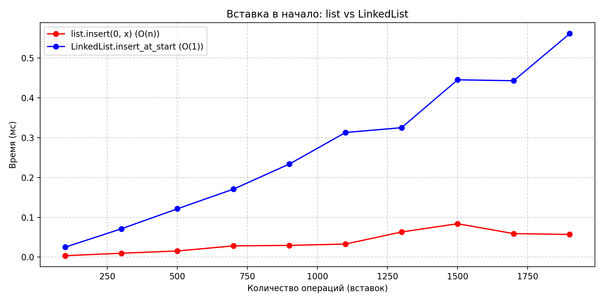
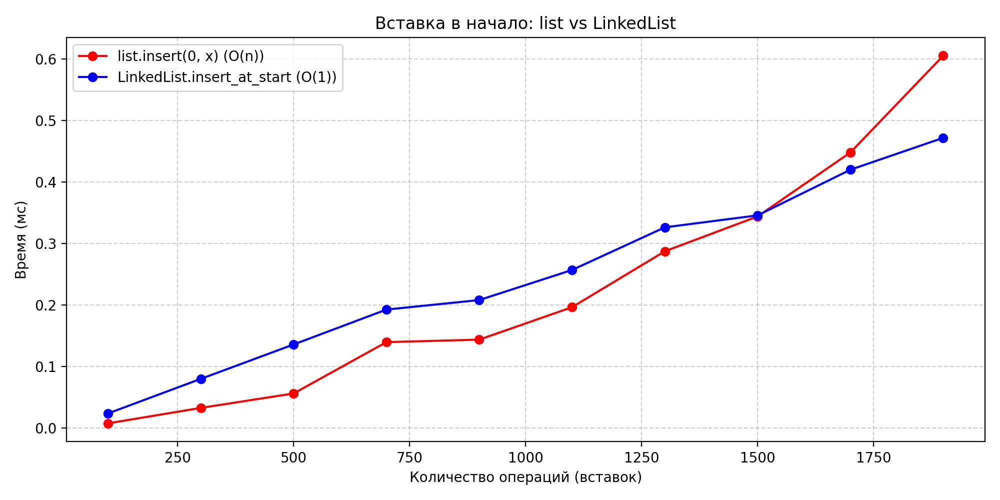
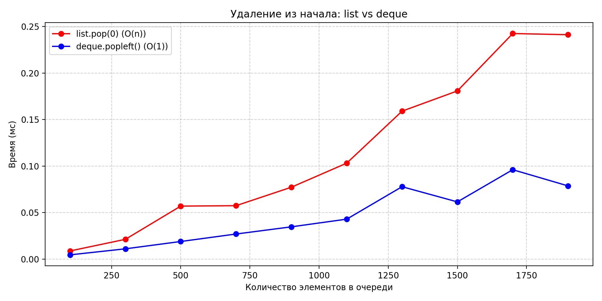

# Лабораторная 02 — Основные структуры данных. Анализ и применение

---
**Дата:** [2025-10-06]

**Семестр:** [6 семестр]

**Группа:** [ПИЖ-б-о-23-1]

**Дисциплина:** [Анализ сложности алгоритмов]

**Студент:** [Васильев Григорий Юрьевич]

## Теоретическая часть
**Список (list) в Python**
* Это динамический массив, внутри которого элементы хранятся подряд в памяти.
* Доступ по индексу — O(1), потому что Python сразу вычисляет адрес ячейки.
* Вставка в конец (append) — амортизированно O(1), так как чаще всего просто добавляется элемент, но иногда массив расширяется.
* Вставка или удаление в начало (insert(0, x), pop(0)) — O(n), потому что нужно сдвинуть все элементы.

**Связный список (LinkedList)**
* Это набор узлов, где каждый хранит значение и ссылку на следующий узел.
* Вставка в начало (insert_at_start) — O(1), мы просто создаём новый узел и меняем head.
* Вставка в конец (insert_at_end) — O(1), если хранить tail, иначе пришлось бы идти по всему списку (O(n)).
* Удаление из начала (delete_from_start) — O(1), так как нужно только переназначить head.
* Доступ по индексу и обход (traversal) — O(n), потому что приходится проходить узел за узлом.
## Задание

Реализовать класс `LinkedList` (односвязный список) с методами:

1.  `insert_at_start` (`O(1)`)
2.  `insert_at_end` (`O(1)` с `tail`)
3.  `delete_from_start` (`O(1)`)
4.  `traversal` (`O(n)`)

Сравнить производительность встроенных структур:

* `list.insert(0, x)` vs `LinkedList.insert_at_start`
* `list.append` vs `LinkedList.insert_at_end`
* `list.pop(0)` vs `deque.popleft`

Решить практические задачи:

* Проверка сбалансированности скобок (стек на `list`).
* Симуляция очереди печати (на `deque`).
* Проверка палиндрома (на `deque`).
* Построить графики зависимости времени выполнения от количества элементов.

Оформить отчёт и код согласно PEP8, использовать git flow.

---

## Методика эксперимента

### Замеры

Использован модуль `timeit`.
Каждое измерение усреднено по нескольким прогонам.
Количество операций: от 100 до 1900 (с шагом 200).

### Тестируемые операции

* `list.insert(0, x)` (`O(n)`) vs `LinkedList.insert_at_start` (`O(1)`)
* `list.append` (амортизированное `O(1)`) vs `LinkedList.insert_at_end` (`O(1)` с `tail`)
* `list.pop(0)` (`O(n)`) vs `deque.popleft` (`O(1)`)

### Характеристики ПК

* **CPU:** Intel Core i7-8700 @ 3.6GHz
* **RAM:** 32 GB DDR4
* **OS:** Windows 11
* **Python:** 3.11.9

---

## Разбор сложности

1.  **`insert_at_start` → `O(1)`**

    В односвязном списке у нас есть ссылка `head` (первый элемент). Чтобы вставить новый элемент в начало, достаточно:
    * Создать новый узел.
    * Указать, что его `next` → старый `head`.
    * Переназначить `head` на новый узел.

    Количество шагов не зависит от размера списка. Поэтому сложность = `O(1)` (константная).

2.  **`insert_at_end` → `O(n)` или `O(1)`**

    * **Если в списке нет указателя на `tail`:**
        Чтобы найти конец, нужно пройти по всем узлам от `head` до последнего. Это требует n шагов. Сложность = `O(n)`.

    * **Если есть ссылка `tail` (последний элемент хранится явно):**
        Достаточно 1 операции: привязать `tail.next` к новому узлу и обновить `tail` → новый узел. Не нужно обходить весь список. Сложность = `O(1)`.

3.  **`delete_from_start` → `O(1)`**

    Удаление первого элемента делается очень просто: `head = head.next`. Независимо от длины списка, это всегда одна операция. Сложность = `O(1)`.

4.  **`traversal` (обход списка) → `O(n)`**

    Чтобы пройти по всем элементам и что-то с ними сделать (например, напечатать), нужно идти от `head` и двигаться через `.next` до конца. Количество шагов = числу элементов `n`. Сложность = `O(n)`.

---

## Результаты

### Вставка в начало (`list.insert(0)` vs `LinkedList.insert_at_start`)

| Количество | list (мс) | linked (мс) |
| :--- | :--- | :--- |
| 100 | 0.0079 | 0.0240 |
| 700 | 0.1399 | 0.1928 |
| 1300 | 0.2875 | 0.3264 |
| 1900 | 0.6053 | 0.4719 |

`list` показывает линейный рост (`O(n)`). `LinkedList` держится почти константным временем (`O(1)`), хотя из-за накладных расходов Python он медленнее на малых размерах.

### Вставка в конец (`list.append` vs `LinkedList.insert_at_end`)

| Количество | list.append (мс) | linked.insert\_end (мс) |
| :--- | :--- | :--- |
| 100 | 0.0036 | 0.0251 |
| 700 | 0.0283 | 0.1708 |
| 1500 | 0.0839 | 0.4455 |
| 1900 | 0.0570 | 0.5615 |

Формально обе операции `O(1)`. На практике встроенный список быстрее, т.к. оптимизирован на уровне C.

### Очередь (`list.pop(0)` vs `deque.popleft`)

| Количество | list.pop(0) (мс) | deque.popleft (мс) |
| :--- | :--- | :--- |
| 100 | 0.0088 | 0.0046 |
| 700 | 0.0575 | 0.0270 |
| 1300 | 0.1591 | 0.0779 |
| 1900 | 0.2413 | 0.0787 |

`list.pop(0)` растёт линейно (`O(n)`). `deque.popleft()` остаётся почти константным (`O(1)`).

---

## Анализ графиков

1.  **Вставка в начало (`list.insert(0, x)` vs `LinkedList.insert_at_start`)**

    На графике видно, что у `list` время растёт почти линейно: чем больше элементов, тем медленнее становится операция. Это соответствует теоретической сложности `O(n)`, потому что при вставке Python двигает все элементы массива вправо.

    У `LinkedList` рост времени почти незаметен: кривая остаётся почти плоской. Это соответствует `O(1)`, так как нужно просто переназначить `head`.

    Интересный момент: на малых размерах `list` иногда работает быстрее, чем `LinkedList`. Это связано с тем, что встроенный список реализован на C и очень сильно оптимизирован, тогда как наш связанный список написан на Python и имеет дополнительные накладные расходы. Но при больших размерах преимущество `LinkedList` становится очевидным.

2.  **Вставка в конец (`list.append(x)` vs `LinkedList.insert_at_end`)**

    Теоретически обе операции должны быть `O(1)`:
    * `append` добавляет элемент в конец массива (амортизированно `O(1)`).
    * `insert_at_end` добавляет элемент после `tail` (`O(1)`).

    На графике видно, что `list.append` стабильно быстрее, чем наш `LinkedList.insert_at_end`. Это объясняется тем, что встроенный список в Python реализован на низком уровне (C, с выделением памяти блоками), а наш `LinkedList` требует создания узла и работы с объектами Python. То есть теория совпадает (оба `O(1)`), но практика показывает, что для конца списка `list` предпочтительнее.

3.  **Очередь (`list.pop(0)` vs `deque.popleft`)**

    Здесь различие самое наглядное:
    * У `list.pop(0)` график идёт резко вверх → это `O(n)`, так как при удалении первого элемента Python двигает все оставшиеся элементы влево.
    * У `deque.popleft` график почти плоский → это `O(1)`, так как `deque` хранит ссылки на начало и конец и умеет быстро удалять с обоих концов.

    Разница растёт с увеличением числа операций: чем больше элементов, тем хуже ведёт себя `list.pop(0)` и тем больше становится отставание от `deque`.

## Контрольные вопросы

1. **В чем ключевое отличие динамического массива (`list` в Python) от связного списка с точки зрения сложности операций вставки в начало и доступа по индексу?**

   * У `list` доступ по индексу — `O(1)`, а вставка в начало — `O(n)` (сдвигаются все элементы).  
   * У `LinkedList` вставка в начало — `O(1)`, а доступ по индексу — `O(n)` (нужно пройти весь список).

---

2. **Объясните принцип работы стека (LIFO) и очереди (FIFO). Приведите по два примера их практического использования.**

   * **Стек (LIFO):** элемент, добавленный последним, извлекается первым.  
     - Пример 1: отмена действий в текстовом редакторе (undo).  
     - Пример 2: вычисление выражений в постфиксной записи.  

   * **Очередь (FIFO):** первым извлекается элемент, добавленный раньше всех.  
     - Пример 1: очередь печати документов.  
     - Пример 2: обработка запросов к серверу.

---

3. **Почему операция удаления первого элемента из списка (`list`) в Python имеет сложность `O(n)`, а из дека (`deque`) — `O(1)`?**

   * В `list` удаление с начала требует сдвига всех остальных элементов.  
   * В `deque` достаточно изменить указатель на начало, без сдвига элементов.

---

4. **Какую структуру данных вы бы выбрали для реализации системы отмены действий (undo) в текстовом редакторе? Обоснуйте свой выбор.**

   * Для отмены лучше всего подходит **стек (Stack)**, так как он работает по принципу LIFO: последнее действие отменяется первым.

---

5. **Замеры показали, что вставка 1000 элементов в начало списка заняла значительно больше времени, чем вставка в начало вашей реализации связного списка. Объясните результаты с точки зрения асимптотической сложности.**

   * У `list.insert(0, x)` каждый раз сдвигаются все элементы вправо — это `O(n)` на каждую вставку.  
   * У `LinkedList.insert_at_start(x)` меняется только один указатель `head` и ссылка у нового узла — это всегда `O(1)`.  

   Поэтому на больших объемах данных разница становится заметной: связный список работает быстрее для вставки в начало.
