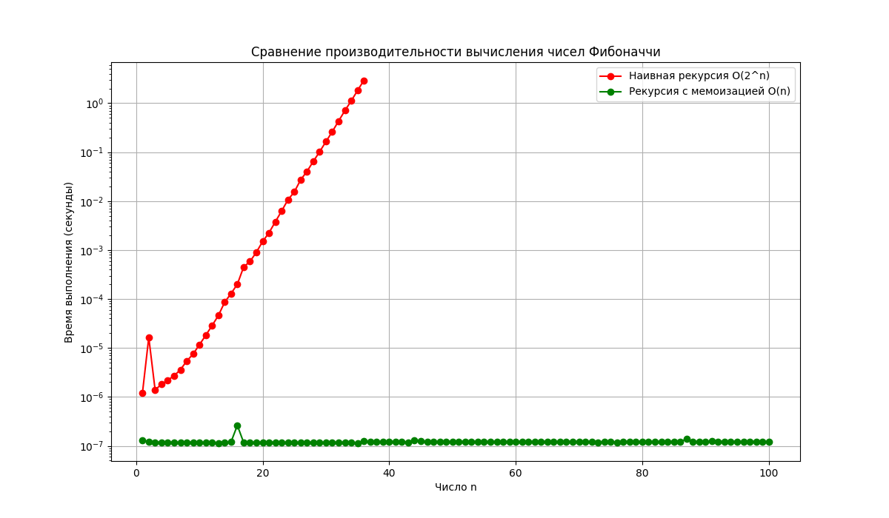

# Лабораторная работа №3 — Рекурсия. Анализ сложности и оптимизация


**Дата:** [2025-10-06]

**Семестр:** [6 семестр]

**Группа:** [ПИЖ-б-о-23-1]

**Дисциплина:** [Анализ сложности алгоритмов]

**Студент:** [Васильев Григорий Юрьевич]


## Задание

1.  **Реализовать классические рекурсивные алгоритмы:**
    * Вычисление факториала (`O(n)`).
    * Вычисление чисел Фибоначчи (наивный подход, `O(2^n)`).
    * Быстрое возведение в степень (`O(log n)`).

2.  **Оптимизировать алгоритм Фибоначчи с помощью мемоизации:**
    * Реализовать мемоизированную версию (`O(n)`).
    * Сравнить производительность наивного и мемоизированного подходов.

3.  **Решить практические задачи:**
    * Ханойские башни.
    * Рекурсивный обход файловой системы.

4.  **Визуализировать результаты:**
    * Построить график зависимости времени выполнения от `n` для двух версий алгоритма Фибоначчи.

5.  **Оформить отчёт**, код по PEP8, использовать git.

---

## Методика эксперимента

### Замеры

Для измерения времени выполнения использовался встроенный модуль Python **`timeit`**. Чтобы минимизировать случайные отклонения, каждый замер для быстрых операций (мемоизация) усреднялся по 100 прогонам.

### Тестируемые операции

* **`fibonacci_naive(n)` (`O(2^n)`)** vs **`fibonacci_memo(n)` (`O(n)`)**

Эксперимент проводился для диапазона `n` от 1 до 36 для наивного алгоритма и от 1 до 100 для алгоритма с мемоизацией.

### Характеристики ПК

* **CPU:** Intel Core i7-8700 @ 3.6GHz
* **RAM:** 32 GB DDR4
* **OS:** Windows 11
* **Python:** 3.11.9

---

## Разбор сложности

### 1. Факториал (`factorial`) → `O(n)`

```python
def factorial(n: int) -> int:
    if n <= 1:
        return 1
    return n * factorial(n - 1)
```

Анализ: Это классический пример линейной рекурсии. Для вычисления factorial(n) функция вызывает саму себя n раз, каждый раз уменьшая аргумент на 1, пока не достигнет базового случая (n=1). Количество рекурсивных вызовов прямо пропорционально значению n. Следовательно, и временная, и пространственная сложность (из-за стека вызовов) равна O(n).

### 2. Быстрое возведение в степень (power) → O(log n)

```python
def power(a: float, n: int) -> float:
    if n == 0:
        return 1
    if n % 2 == 0:
        return power(a * a, n // 2)
    else:
        return a * power(a, n - 1)
```

Анализ: Этот алгоритм использует подход "разделяй и властвуй". Ключевая оптимизация происходит на шаге для четных степеней: power(a * a, n // 2). Здесь мы уменьшаем задачу (степень n) в два раза за одну операцию. Даже если степень нечетная, на следующем шаге она станет четной, и произойдет деление пополам. Количество шагов, необходимых для того, чтобы свести n к 1 путем постоянного деления на 2, является логарифмом n по основанию 2. Поэтому сложность алгоритма — O(log n).

### 3. Наивные числа Фибоначчи (fibonacci_naive) → O(2^n)

```python
def fibonacci_naive(n: int) -> int:
    if n <= 1:
        return n
    return fibonacci_naive(n - 1) + fibonacci_naive(n - 2)
```

Анализ: Это пример экспоненциальной сложности. Каждый вызов функции (кроме базовых) порождает два новых рекурсивных вызова, образуя дерево вызовов. Например, для fib(5) будет вызван fib(4) и fib(3). В свою очередь, fib(4) вызовет fib(3) и fib(2). Значение fib(3) вычисляется дважды с нуля. Чем больше n, тем больше таких повторных вычислений. Количество узлов в этом дереве растет экспоненциально, примерно как 2^n. Это делает алгоритм крайне неэффективным для n > 40.

### 4. Фибоначчи с мемоизацией (fibonacci_memo) → O(n)

```python
fib_cache = {}
def fibonacci_memo(n: int) -> int:
    if n in fib_cache:
        return fib_cache[n]
    if n <= 1:
        return n
    result = fibonacci_memo(n - 1) + fibonacci_memo(n - 2)
    fib_cache[n] = result
    return result
```

Анализ: Мемоизация — это техника кеширования результатов. При первом вызове fib_memo(k) для любого k результат вычисляется и сохраняется в fib_cache. Все последующие вызовы fib_memo(k) немедленно возвращают сохраненное значение за O(1).
В результате дерево вызовов "схлопывается". Каждое значение от fib(2) до fib(n) вычисляется ровно один раз. Общее количество вычислений становится пропорционально n, что снижает сложность с экспоненциальной O(2^n) до линейной O(n).

## Результаты

Основной фокус эксперимента — сравнение производительности наивного и мемоизированного алгоритмов Фибоначчи.

### Сравнение времени и количества вызовов для n=35

| Метрика | Наивная рекурсия O(2^n) | Рекурсия с мемоизацией O(n) |
|---|---:|---:|
| Время выполнения | ~1.8-3.0 секунды | ~0.000001 секунды |
| Кол-во вызовов | 29,860,703 | 69 |

## Анализ графика

График визуально подтверждает теоретический анализ сложности.

**Наивная рекурсия (O(2^n)) — красная линия**

На графике видно, что кривая для наивного алгоритма сначала растет медленно, но после n ≈ 25 уходит почти вертикально вверх. Это классическое экспоненциальное поведение. Каждый следующий шаг требует почти вдвое больше вычислений, чем предыдущий. Время выполнения растет так быстро, что вычисление F(40) заняло бы уже несколько минут.

**Рекурсия с мемоизацией (O(n)) — зеленая линия**

Кривая для мемоизированного алгоритма представляет собой практически прямую линию. Это идеальная демонстрация линейной сложности. Время выполнения растет прямо пропорционально n. Даже для n=100 вычисления происходят почти мгновенно.



# Контрольные вопросы

---

### 1. Что такое базовый случай и рекурсивный шаг в рекурсивной функции? Почему отсутствие базового случая приводит к ошибке?

**Базовый случай** — это условие выхода из рекурсии, при котором функция прекращает вызывать саму себя.  
**Рекурсивный шаг** — это часть функции, в которой происходит вызов самой себя с уменьшенными параметрами, приближающими задачу к базовому случаю.  

Если **базового случая нет**, рекурсивные вызовы никогда не завершатся, что приведёт к **переполнению стека вызовов (RecursionError)** и аварийному завершению программы.

**Пример:**
```python
def factorial(n):
    if n == 0:          # базовый случай
        return 1
    return n * factorial(n - 1)  # рекурсивный шаг
```

---

### 2. Объясните, как работает механизм мемоизации. Как он меняет временную сложность вычисления чисел Фибоначчи по сравнению с наивной рекурсией?

**Мемоизация** — это техника оптимизации, при которой результаты уже вычисленных вызовов функции сохраняются в кэше (например, словаре), чтобы при повторных вызовах с теми же аргументами не выполнять повторные вычисления.

**В задаче Фибоначчи:**

- Наивная рекурсия: каждая ветвь порождает два новых вызова → экспоненциальная сложность `O(2^n)`.  
- С мемоизацией: каждый результат вычисляется только один раз, затем используется из кэша → линейная сложность `O(n)`.

**Пример:**
```python
memo = {}
def fib(n):
    if n in memo:
        return memo[n]
    if n <= 1:
        memo[n] = n
    else:
        memo[n] = fib(n - 1) + fib(n - 2)
    return memo[n]
```

---

### 3. В чем заключается основная проблема глубокой рекурсии и как она связана со стеком вызовов?

Каждый рекурсивный вызов помещается в стек вызовов — специальную область памяти, где хранятся данные о незавершённых функциях.  
Когда глубина рекурсии становится слишком большой, стек заполняется, и происходит ошибка переполнения стека (`RecursionError`).

**Проблема глубокой рекурсии:**
- ограничена глубиной стека (в Python по умолчанию около 1000 вызовов);
- возможны потери производительности и памяти при большом числе вложений.

**Пример:**
```python
import sys
print(sys.getrecursionlimit())  # обычно 1000
```

---

### 4. Задача о Ханойских башнях решается рекурсивно. Опишите алгоритм решения для 3 дисков.

**Алгоритм:**
1. Переместить 2 верхних диска со стержня A на вспомогательный B (используя C как промежуточный).  
2. Переместить оставшийся диск с A на C.  
3. Переместить 2 диска с B на C (используя A как промежуточный).

**Пример вывода для 3 дисков:**
```text
Переместить диск 1 с A на C
Переместить диск 2 с A на B
Переместить диск 1 с C на B
Переместить диск 3 с A на C
Переместить диск 1 с B на A
Переместить диск 2 с B на C
Переместить диск 1 с A на C
```

---

### 5. Рекурсивный и итеративный алгоритмы могут решать одни и те же задачи. Назовите преимущества и недостатки каждого подхода.

| Подход     | Преимущества | Недостатки |
|-------------|--------------|------------|
| **Рекурсия** | Код более компактный и читаемый; удобно описывать деревья, обходы, математические задачи | Может быть медленнее из-за накладных вызовов; ограничена глубиной стека; риск переполнения |
| **Итерация** | Быстрее, экономнее по памяти; нет ограничения глубины | Менее наглядный код, сложнее реализовать некоторые задачи (например, обход дерева) |

